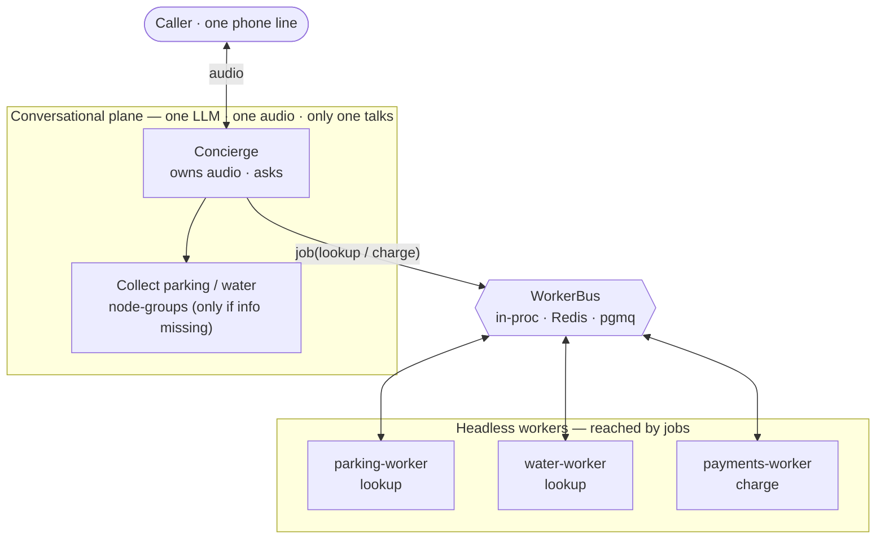
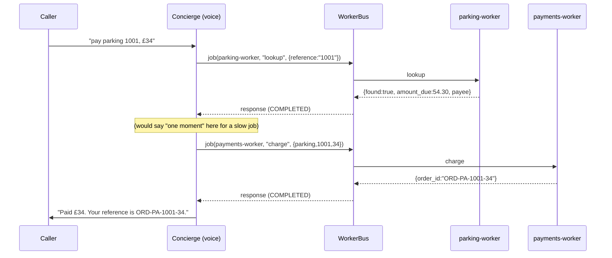

# Hybrid: one conversation, many headless workers

A reference scaffold for splitting a voice payment bot into **one conversational
agent** and **several headless workers**, using Pipecat's **Workers + Bus + Jobs**.

It's self-contained — it does **not** import or modify the live bot in
`server/bots/`. Run it on native Windows with no audio, no API keys, no FreeSWITCH.

---

## The one idea

There is **one caller, one audio stream, one LLM**, so only **one** agent can ever
be *talking*. That single fact decides where each piece of work belongs:

| Work | Needs the caller? | Where it runs | Mechanism |
|---|---|---|---|
| Ask questions ("which amount?", meter reading) | **Yes** — owns the mic/speaker | Conversational plane | Flows node-group (swap the active node) |
| Look up a balance, charge a card, validate | **No** — pure logic | Headless workers | **Job** over the bus |

The boundary is **"does it need the caller?"** — *not* "parking vs water". Collection
stays in the conversation; lookup/charge become jobs you can fan out and scale.

---

## Architecture



Blue-plane boxes share one LLM/one audio; green workers are separate runnable units
the concierge reaches only through named jobs on the bus.

## Sequence — "pay parking 1001, £34"

All info is present, so collection is skipped and both halves become jobs:



If the caller had said *"pay my parking ticket"* (no number), the Concierge would
first enter the blue **Collect parking** node-group to ask for it — on the shared
conversation — and only *then* drop to the jobs.

---

## Files

| File | Role |
|---|---|
| `services.py` | Mock domain logic — `lookup_bill`, `charge_card`. Swap for real DB / gateway. |
| `workers.py` | Headless `BaseWorker`s with `@job` handlers (`LookupWorker`, `PaymentsWorker`). |
| `dispatch.py` | Concierge-side `lookup_bill_job` / `charge_bill_job` — the line that crosses the boundary. |
| `run_demo.py` | Audio-free driver: starts the workers + a `ConciergeDriver` and plays scripted requests. |

## What the workers do NOT do

The workers hold **no conversation**. They never gather data and never answer the
caller — so a question like *"what is a reference number?"* never reaches
`parking-worker`. Asking for the reference, answering field help, new-vs-old
disambiguation, and asking "how much?" all live in the **Collect parking / water
node-group** on the shared conversation (in the multiagent bot: `record_slots`,
`explain_current_field` reading `CollectStep.help`). A worker is invoked only
*after* collection is complete, with a finished value.

Why: a headless worker has no mic/speaker, and multi-turn gathering is turn-taking —
which belongs to the single agent that owns the audio. (A worker *can* answer a
one-shot question by returning *text* for the concierge to speak — the
`sensor-controller` pattern — but reach for that only when the answer needs data the
concierge lacks; a static help string is simpler.)

## Job contract

| Target worker | job `name` | payload | response |
|---|---|---|---|
| `parking-worker` / `water-worker` | `lookup` | `{reference}` | `{found, bill_type, reference, payee, amount_due, currency}` — always COMPLETED |
| `payments-worker` | `charge` | `{bill_type, reference, amount, currency}` | `{order_id}` COMPLETED · `{error}` FAILED |

Two failure kinds, deliberately distinct:
- **Not found** (unknown reference) → normal `{"found": false}` COMPLETED — a business
  outcome, the concierge re-asks.
- **Gateway down** (reference `9999`) → `send_job_response(..., status=FAILED)` → the
  caller's `job()` raises `JobError` — a system error, the concierge apologises.

---

## Run it

```bash
cd server/examples/hybrid_workers
python run_demo.py
```

Expected (order of the middle two lines may interleave — workers run concurrently):

```
── caller: pay parking 1001, £34
   balance is £54.30 for City Parking
parking-worker: 1001 -> 54.30 GBP
payments-worker: charged 34 for parking 1001 -> ORD-PA-1001-34
   concierge would say: paid £34. Your reference is ORD-PA-1001-34.
── caller: pay water 2220, £61.2
   balance is £61.20 for Anytown Water
   concierge would say: paid £61.2. Your reference is ORD-WA-2220-61
── caller: pay parking 7777, £10
   concierge would say: I couldn't find parking 7777.
── caller: pay parking 9999, £20
   balance is £40.00 for City Parking
   concierge would say: sorry, the payment didn't go through (...).
```

*(Requires the project venv where the editable `pipecat` submodule is installed —
the same interpreter that runs the live bot.)*

---

## Grafting onto the real voice / FreeSWITCH bot

Nothing here is audio-specific. To wire it into the running bot:

1. **Register the workers on the existing runner.** In `base_bot.py`, where the
   `PipelineWorker` is added to the `WorkerRunner`, also add:

   ```python
   from examples.hybrid_workers.workers import LookupWorker, PaymentsWorker
   await runner.add_workers(
       self.worker,                              # the conversational PipelineWorker
       LookupWorker("parking-worker", "parking"),
       LookupWorker("water-worker", "water"),
       PaymentsWorker("payments-worker"),
   )
   ```

2. **Dispatch from a tool / flow function**, where `params.pipeline_worker` is the
   conversational worker on the bus:

   ```python
   from examples.hybrid_workers.dispatch import charge_bill_job

   async def pay_now(params: FunctionCallParams, bill_type: str, reference: str, amount: float):
       await params.result_callback("One moment while I take that.")   # caller waits during the job
       result = await charge_bill_job(params.pipeline_worker,
                                      bill_type=bill_type, reference=reference, amount=amount)
       await params.result_callback(f"Paid. Your reference is {result['order_id']}.")
   ```

   In your **Flows** bot the same call works from a flow function via the
   flow manager's worker; the collection node-groups (`collect_parking` /
   `collect_water`) stay exactly as they are — only the final lookup/charge move
   behind jobs.

Because the bus can be swapped to **Redis/pgmq**, those workers can then run in
**separate processes or machines** — the lever for the 3–5k-concurrent target: the
conversation stays one-per-call, the lookup/payment tier scales on its own.

### Caveat the sequence diagram makes honest
A job round-trip happens **while the caller waits on the line**. For a fast
lookup+charge that's fine; if a worker could be slow, speak a filler
(`"one moment…"`) *before* dispatching — nothing else can talk during that gap.

---

## Where this pattern comes from

Pipecat's own multi-worker examples (in this repo under
`external/pipecat/examples/multi-worker/`):

- **`sensor-controller/`** — a voice agent whose tool does
  `async with params.pipeline_worker.job("sensor-controller", payload=…) as t` and
  speaks `t.response`. The concierge→worker dispatch.
- **`code-assistant/code_worker.py`** — a bus-only `BaseWorker` that consumes job
  requests and replies with `send_job_response`. The headless-worker shape.

API surface used here: `@job(name=…)` ([`pipeline/job_decorator.py`]),
`BaseWorker.job(worker_name, name=…, payload=…, timeout=…)`,
`send_job_response(job_id, response, status=…)`, `JobStatus`/`JobError`
([`pipeline/job_context.py`]), and `WorkerRunner.add_workers/run/cancel`
([`workers/runner.py`]).
